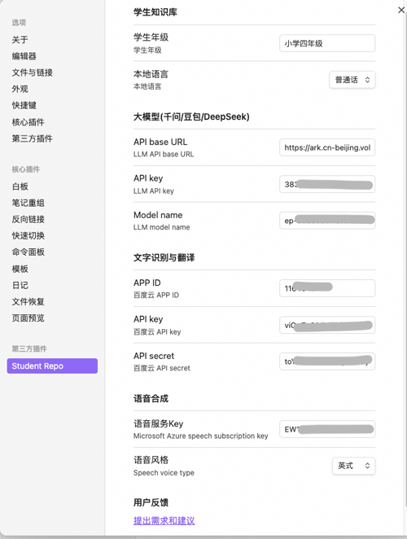
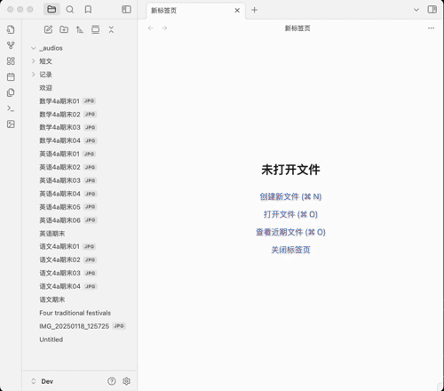
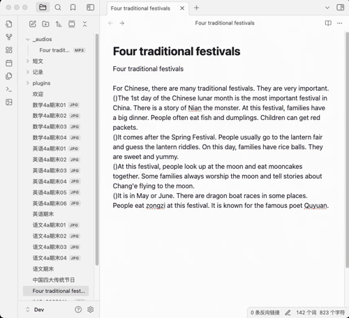
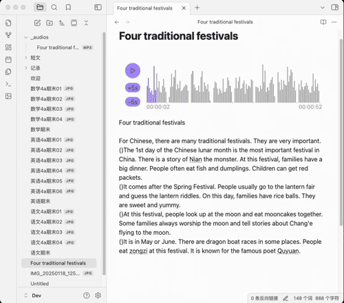
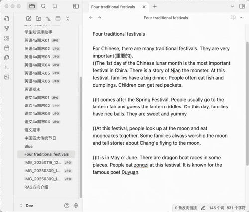
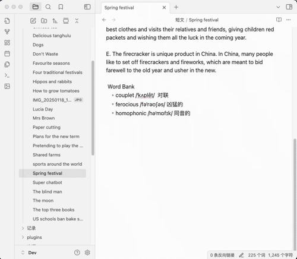
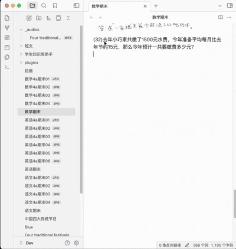
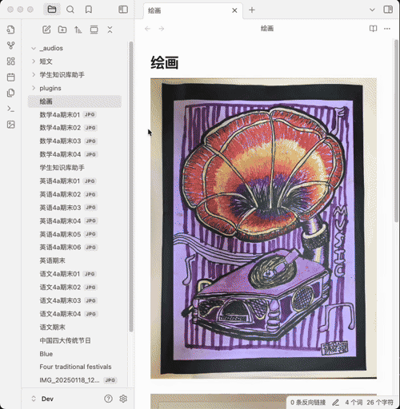

<h4 align="center">
	

		<a href="https://github.com/yingflower/obsidian-stu-repo-helper/blob/master/README_en.md">English</a> |
			<b>中文</b>
	

</h4>

# 简介
学生知识库助手（Student Repository Helper）是一个面向学生或学生家长的Obsidian 插件，这款插件旨在解决学生在学习阶段面临的资料管理难题，将学习过程中产生的各类重要资料，如试卷、笔记、关键文档、绘画手工作品等，进行系统性的数字化整合与管理，并利用 AI 助手定期进行学习分析总结。随着时间的推移，它将助力你逐步搭建起一座专属你自己的知识宝库，这座宝库将伴随你一生，成为你知识成长与积累的见证。

## 特性
- ***图片一键转档*** ：将试卷图片/绘画作品迅速、精准地转化为 markdown 文档，极大地方便后续的编辑与资料整理工作。
- ***智能图文识别*** ：运用先进的图文识别技术，高效提取试卷图片中的文字信息，并自动生成 markdown 文档，让关键信息的获取变得轻松高效。
- ***英语学习专属助手*** ：针对英语学习场景，不仅能为英语短文生成专业、地道的配音，还将机器翻译，生词管理，语法分析有机的结合到学习过程中，为学习者营造沉浸式的英语学习体验。
- ***重点题目智能分析拓展*** ：借助大模型技术，深入分析重点题目知识点，并根据题目特征生成新的拓展题目，帮助学生强化学习效果，加深知识理解。
- ***绘画作品智能分析*** : 利用 AI 助手对绘画作品进行智能分析，提取关键信息并自动生成 Markdown 文档，为后续资料检索提供便利。
## AI 服务提供商
知识库搭建过程中会用到的 AI 服务以及其对应的账号申请链接如下，请大家按需申请：

**大语言模型** 
- 字节豆包：[开通指南](https://github.com/yingflower/obsidian-stu-repo-helper/blob/master/docs/%E5%BC%80%E9%80%9A%E5%A4%A7%E6%A8%A1%E5%9E%8B%E6%9C%8D%E5%8A%A1%E6%8C%87%E5%8D%97.md#%E5%BC%80%E9%80%9A%E8%B1%86%E5%8C%85%E5%A4%A7%E6%A8%A1%E5%9E%8B%E6%9C%8D%E5%8A%A1%E8%B4%A6%E5%8F%B7)
- Deepseek：[开通指南](https://github.com/yingflower/obsidian-stu-repo-helper/blob/master/docs/%E5%BC%80%E9%80%9A%E5%A4%A7%E6%A8%A1%E5%9E%8B%E6%9C%8D%E5%8A%A1%E6%8C%87%E5%8D%97.md#%E5%BC%80%E9%80%9Adeepseek%E5%A4%A7%E6%A8%A1%E5%9E%8B%E6%9C%8D%E5%8A%A1%E8%B4%A6%E5%8F%B7)
- 阿里通义千问：[开通指南](https://github.com/yingflower/obsidian-stu-repo-helper/blob/master/docs/%E5%BC%80%E9%80%9A%E5%A4%A7%E6%A8%A1%E5%9E%8B%E6%9C%8D%E5%8A%A1%E6%8C%87%E5%8D%97.md#%E5%BC%80%E9%80%9A%E5%8D%83%E9%97%AE%E5%A4%A7%E6%A8%A1%E5%9E%8B%E6%9C%8D%E5%8A%A1%E8%B4%A6%E5%8F%B7)

**文字识别**
- 百度云通用文字识别（高精度版）：[开通指南](https://github.com/yingflower/obsidian-stu-repo-helper/blob/master/docs/%E5%BC%80%E9%80%9A%E7%99%BE%E5%BA%A6%E4%BA%91%E6%96%87%E5%AD%97%E8%AF%86%E5%88%AB%E6%9C%8D%E5%8A%A1%E6%8C%87%E5%8D%97.md)

**语音合成**
- 微软Azure：[开通指南](https://github.com/yingflower/obsidian-stu-repo-helper/blob/master/docs/%E5%BC%80%E9%80%9A%E5%BE%AE%E8%BD%AFAzure%E8%AF%AD%E9%9F%B3%E6%9C%8D%E5%8A%A1%E6%8C%87%E5%8D%97.md)

## 如何使用
### 配置插件
打开插件设置，输入你的 AI 服务提供商的账号信息，示例如下图：

**注意：** 如果你需要使用绘画分析的功能，那么需要申请并配置一个支持多模态的大模型。否则只需要配置一个支持文本的大模型即可。

### 图片一键转档
图片转成markdown的过程中，插件会根据图片的拍摄时间按顺序将其加入markdown中，所以拍摄时请按照页面顺序进行拍摄。

### 图文识别
在学习过程中，时常会有从试卷图片中提取文字的需求，以便进行后续深入分析与学习。本插件支持一键图片文字识别，操作方式如下：

### 英文短文配音
遇到适合小朋友阅读和背诵的英语短文，可以保存到知识库内。本插件支持将选中的文本转换为音频，并巧妙嵌入到对应文本之中。如此一来，小朋友能够随时随地利用碎片化时间，一边聆听专业朗读，一边学习与记忆短文内容。此外，插件贴心提供英式发音与美式发音的切换选项，满足多样化学习需求。

### 英语文本翻译

### 英语生词库管理
英语学习过程中，遇到不认识的生词，可以将其加入本插件单词库中，单词库按照时间顺序管理生词，还可以关联到出现这一生词的短文，学习者能够结合生词的原文语境，更透彻地理解词汇含义与用法，加深记忆效果。

### 英语语法分析
遇到陌生的英语句型，可借助本插件强大的语法分析功能，依托先进的大模型技术，迅速剖析句型结构，清晰阐释句型含义，帮助你透彻理解复杂句式，轻松攻克语法难点。

### 重点题目智能分析拓展
针对一些易错或重点题型，本插件提供智能分析拓展功能，自动提取题目知识点，给出解答，并根据题型特征生成新的相关题目，帮助学生强化学习效果，加深知识理解。

### 绘画作品分析
本插件支持为学生的一些绘画和手工作品自动生成命名和描述，方便后期管理和检索，让每一份珍贵创作都能被妥善留存与高效利用。

### 规划中功能：
- 知识库内容检索；