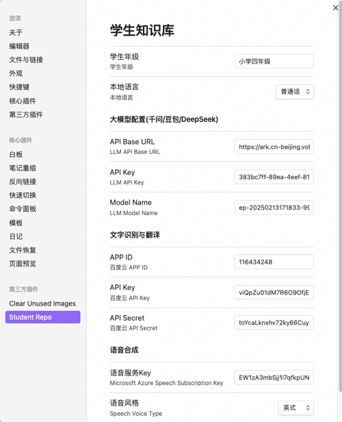

<h4 align="center">
	

		<a href="https://github.com/yingflower/obsidian-stu-repo-helper/blob/master/README_en.md">English</a> |
			<b>中文</b>
	

</h4>

# 简介
学生知识库助手（Student Repository Helper）是一个面向学生或学生家长的Obsidian 插件，这款插件旨在解决学生在学习阶段面临的资料管理难题，将学习过程中产生的各类重要资料，如试卷、笔记、关键文档等，进行系统性的数字化整合与管理，并利用 AI 助手定期进行学习分析总结。随着时间的推移，它将助力你逐步搭建起一座专属你自己的知识宝库，这座宝库将伴随你一生，成为你知识成长与积累的坚实见证。

## 特性
- ***试卷图片一键转档*** ：将试卷图片迅速、精准地转化为 markdown 文档，极大地方便后续的编辑与资料整理工作。
- ***图文智能识别转换*** ：运用先进的图文识别技术，高效提取试卷图片中的文字信息，并自动生成 markdown 文档，让关键信息的获取变得轻松高效。
- ***英语学习专属助手*** ：针对英语学习场景，不仅能为英语短文生成专业、地道的配音，还能将音频与文字完美整合为 markdown 文档，为学习者营造沉浸式的英语学习体验。
- ***错题智能分析拓展*** ：通过智能算法，深入分析错题知识点，自动整理归纳，并根据错题特征生成新的相关题目，帮助学生强化学习效果，加深知识理解。
## AI 服务提供商
知识库搭建过程中会用到的 AI 服务以及其对应的账号申请链接如下，请大家按需申请：
- 大语言模型：[阿里通义千问](https://bailian.console.aliyun.com/?apiKey=1#/api-key)
- 文字识别：[百度云通用文字识别（高精度版）](https://console.bce.baidu.com/ai-engine/ocr/overview/index?_=1740120172878)
- 语音合成：[微软Azure](https://portal.azure.com/#create/Microsoft.CognitiveServicesSpeechServices)
- 文字翻译：[微软Azure](https://portal.azure.com/#create/Microsoft.CognitiveServicesTextTranslation)
## 如何使用
### 配置插件
打开插件设置，输入你的 AI 服务提供商的账号信息，示例如下图：

### 试卷图片一键转档

### 图文识别转换

### 英文短文配音

### 英语单词翻译

### 题目智能分析拓展

## 建议
为了更好的控制音频播放，建议安装：[Obsidian Audio Player 插件](https://github.com/noonesimg/obsidian-audio-player).