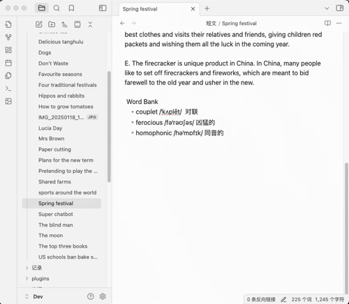
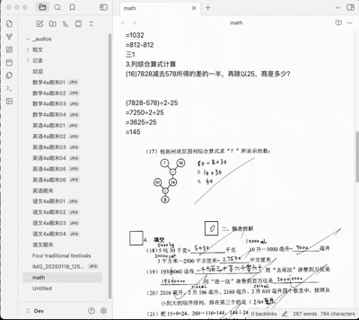

<h4 align="center">
    

        <b>English</b> |
        <a href="https://github.com/yingflower/obsidian-stu-repo-helper/blob/master/README.md">中文</a>
    

</h4>

# Introduction
The Student Repository Helper is an Obsidian plugin designed for students or their parents. This plugin aims to solve the challenges students face in managing learning materials during their study. It systematically integrates and manages various important materials generated in the learning process, such as test papers, notes, and key documents, and utilizes an AI assistant to conduct regular learning analysis and summaries. As time goes by, it will help you gradually build your own exclusive knowledge repository, which will accompany you throughout your life and serve as a solid testimony to your knowledge growth and accumulation.

## Features
- ***One-click Image Conversion***: Swiftly and precisely convert test paper images/artwork paintings into Markdown documents, which greatly eases the subsequent editing and data arrangement work.
- ***Intelligent Image and Text Recognition***: Employ advanced image and text recognition technology to efficiently extract the text information from test paper images and automatically generate Markdown documents, making the acquisition of key information effortless and efficient.
- ***Exclusive Assistant for English Learning***: In the context of English learning scenarios, it can not only generate professional and native-sounding voiceovers for English essays, but also organically integrate machine translation, new word management, and grammar analysis into the learning process, creating an immersive English learning experience for learners.
- ***Intelligent Analysis and Expansion of Key Questions***: By leveraging large model technology, conduct in-depth analysis of the knowledge points of key questions, and generate new extended questions based on the characteristics of the questions, helping students enhance their learning effectiveness and deepen their understanding of the knowledge.
- ***Intelligent Analysis of Artwork Paintings***: Utilize the AI assistant to conduct intelligent analysis of artwork paintings, extract key information, and automatically generate Markdown documents, providing convenience for subsequent data retrieval. 

## AI 服务提供商
The following are the AI services used in the process of building the knowledge repository and the corresponding account application links. Please apply as needed:

**Large language model**
- Doubao: [Register introduction](https://github.com/yingflower/obsidian-stu-repo-helper/blob/master/docs/%E5%BC%80%E9%80%9A%E5%A4%A7%E6%A8%A1%E5%9E%8B%E6%9C%8D%E5%8A%A1%E6%8C%87%E5%8D%97.md#%E5%BC%80%E9%80%9A%E8%B1%86%E5%8C%85%E5%A4%A7%E6%A8%A1%E5%9E%8B%E6%9C%8D%E5%8A%A1%E8%B4%A6%E5%8F%B7)
- Deepseek: [Register introduction](https://github.com/yingflower/obsidian-stu-repo-helper/blob/master/docs/%E5%BC%80%E9%80%9A%E5%A4%A7%E6%A8%A1%E5%9E%8B%E6%9C%8D%E5%8A%A1%E6%8C%87%E5%8D%97.md#%E5%BC%80%E9%80%9Adeepseek%E5%A4%A7%E6%A8%A1%E5%9E%8B%E6%9C%8D%E5%8A%A1%E8%B4%A6%E5%8F%B7)
- Alibaba Tongyi Qianwen: [Register introduction](https://github.com/yingflower/obsidian-stu-repo-helper/blob/master/docs/%E5%BC%80%E9%80%9A%E5%A4%A7%E6%A8%A1%E5%9E%8B%E6%9C%8D%E5%8A%A1%E6%8C%87%E5%8D%97.md#%E5%BC%80%E9%80%9A%E5%8D%83%E9%97%AE%E5%A4%A7%E6%A8%A1%E5%9E%8B%E6%9C%8D%E5%8A%A1%E8%B4%A6%E5%8F%B7)

**Text recognition**
- Baidu Cloud General Text Recognition (High-precision Version): [Register introduction](https://github.com/yingflower/obsidian-stu-repo-helper/blob/master/docs/%E5%BC%80%E9%80%9A%E7%99%BE%E5%BA%A6%E4%BA%91%E6%96%87%E5%AD%97%E8%AF%86%E5%88%AB%E6%9C%8D%E5%8A%A1%E6%8C%87%E5%8D%97.md)

**Speech synthesis** 
- Microsoft Azure: [Register introduction](https://github.com/yingflower/obsidian-stu-repo-helper/blob/master/docs/%E5%BC%80%E9%80%9A%E5%BE%AE%E8%BD%AFAzure%E8%AF%AD%E9%9F%B3%E6%9C%8D%E5%8A%A1%E6%8C%87%E5%8D%97.md)

## How to Use
### Configure the Plugin
Open the plugin settings and enter the account information of your AI service provider. An example is shown in the following figure:

**Note**: If you need to use the function of painting analysis, then you need to apply for and configure a large model that supports multi-modalities. Otherwise, simply configuring a large model that supports text will suffice. 

### One-click Image Conversion
During the process of converting an image into a Markdown document, the plugin will add the images to the Markdown in the order of their shooting time. Therefore, please take photos in accordance with the page order.

### Image and Text Recognition
During the learning process, there is often a need to extract text from test paper images for subsequent in - depth analysis and learning. This plugin supports one - click image - text recognition. The operation method is as follows:

### Voiceover for English Essays
When you come across an English essay that is suitable for children to read and recite, you can save it in the knowledge base. This plugin supports converting the selected text into audio and skillfully embedding it into the corresponding text. In this way, children can make use of their fragmented time anytime and anywhere, listening to professional readings while learning and memorizing the content of the essay. In addition, the plugin thoughtfully provides the option to switch between British pronunciation and American pronunciation to meet diverse learning needs.

### Text Translation

### English New Word Bank Management
During the process of English learning, when you encounter unfamiliar new words, you can add them to the word bank of this plugin. The word bank manages new words in chronological order and can also be associated with the essay in which the new word appears. Learners can combine the original context of the new word to have a more thorough understanding of the word's meaning and usage, thus enhancing the memorization effect.

 

### English Grammar Analysis
When you encounter unfamiliar English sentence patterns, you can take advantage of the powerful grammar analysis function of this plugin. Relying on advanced large model technology, it can quickly analyze the structure of the sentence patterns and clearly explain their meanings, helping you thoroughly understand complex sentence structures and easily overcome grammar difficulties.

 

### Intelligent Analysis and Expansion of Key Questions
For some error-prone or key question types, this plugin provides an intelligent analysis and expansion function. It automatically extracts the knowledge points of the questions and generates new related questions according to the characteristics of the question types, helping students strengthen their learning effects and deepen their understanding of knowledge. 

### Analysis of Artwork and Handicrafts
This plugin supports the automatic generation of names and descriptions for students' artwork paintings and handicrafts, which facilitates subsequent management and retrieval. In this way, every precious creation can be properly preserved and efficiently utilized.

 
