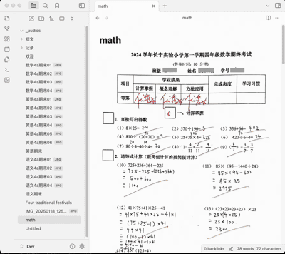

<h4 align="center">
    

        <b>English</b> |
        <a href="https://github.com/yingflower/obsidian-stu-repo-helper/blob/master/README.md">中文</a>
    

</h4>

# Introduction
The Student Repository Helper is an Obsidian plugin designed for students or their parents. This plugin aims to solve the challenges students face in managing learning materials during their study. It systematically integrates and manages various important materials generated in the learning process, such as test papers, notes, and key documents, and utilizes an AI assistant to conduct regular learning analysis and summaries. As time goes by, it will help you gradually build your own exclusive knowledge repository, which will accompany you throughout your life and serve as a solid testimony to your knowledge growth and accumulation.

## Features
- ***One-click conversion of test paper images to documents*** : Quickly and accurately convert test paper images into Markdown documents, greatly facilitating subsequent editing and material organization.
- ***Image and text recognition***: Intelligent recognition and conversion of images and text: Utilize advanced image and text recognition technology to efficiently extract text information from test paper images and automatically generate Markdown documents, making it easy and efficient to obtain key information.
- ***English learning assistant***: Exclusive assistant for English learning: In the context of English learning, it can not only generate professional and authentic voiceovers for English short texts, but also organically integrate machine translation, new word management, and grammatical analysis into the learning process, creating an immersive English learning experience for learners.
- ***Wrong question intelligent analysis and expansion***:  Intelligent analysis and expansion of wrong questions: Through intelligent algorithms, conduct in-depth analysis of the knowledge points in wrong questions, automatically organize and summarize them, and generate new relevant questions based on the characteristics of wrong questions to help students strengthen their learning effects and deepen their understanding of knowledge.
## AI 服务提供商
The following are the AI services used in the process of building the knowledge repository and the corresponding account application links. Please apply as needed:

- Large language model: 

[Alibaba Tongyi Qianwen](https://bailian.console.aliyun.com/?apiKey=1#/api-key)

[Doubao](https://console.volcengine.com/ark/)

[Deepseek](https://platform.deepseek.com/)

- Text recognition: [Baidu Cloud General Text Recognition (High-precision Version)](https://console.bce.baidu.com/ai-engine/ocr/overview/index?_=1740120172878)
- Speech synthesis: [Microsoft Azure](https://portal.azure.com/#create/Microsoft.CognitiveServicesSpeechServices)
- Text translation: [Microsoft Azure](https://portal.azure.com/#create/Microsoft.CognitiveServicesTextTranslation)

## How to Use
### Configure the Plugin
Open the plugin settings and enter the account information of your AI service provider. An example is shown in the following figure:

### One-click Conversion of Test Paper Images to Documents

### Image and Text Recognition and Conversion

### Voiceover for English Essays

### Intelligent Analysis and Expansion of Questions

## Suggestion
To better control audio playback, it is recommended to install the [Obsidian Audio Player plugin](https://github.com/noonesimg/obsidian-audio-player).