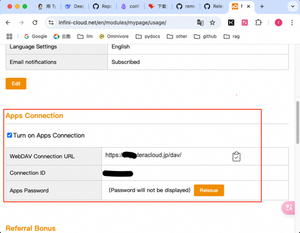

## Introduction to Obsidian
Obsidian is a knowledge management tool that prioritizes local storage and is driven by Markdown. Its core features are:
- **Separation of data and software**: It stores note data in Markdown format, which has strong compatibility and is easy to migrate and back up.
- **Local first**: All data is stored on the user's local device, ensuring privacy and security.
- **Plugin ecosystem**: It supports a rich collection of community plugins, enabling the extension of functions to meet personalized needs.
- **Multi-platform support**: It supports Windows, macOS, Linux, as well as mobile devices (iOS, Android).
- **Real-time sharing across multiple devices**: It supports real-time sharing of knowledge repository data among mobile phones, PCs, and tablets, allowing access to knowledge anytime and anywhere without limitations on learning.

## Create a New Knowledge Repository
In Obsidian, we can store our data by creating a knowledge repository.


Open the directory of the newly created knowledge repository folder, and we can see the directory structure of the knowledge repository:

```shell
├── .obsidian
│   ├── app.json
│   ├── appearance.json
│   ├── core-plugins.json
│   ├── graph.json
│   └── workspace.json
└── Welcome.md
```
The .obsidian folder is a folder used internally by Obsidian, which contains Obsidian's configuration files. Welcome.md is the welcome page created by default in Obsidian. All the folders and notes we create in Obsidian next will be saved in this folder.

## Essential Plugins for the Student Knowledge Repository

### [Remotely Save](https://github.com/remotely-save/remotely-save)
The Remotely Save plugin helps us achieve real-time sharing across multiple devices. It synchronizes local and cloud notes through intelligent conflict handling and supports S3 (Amazon S3/Cloudflare R2/Backblaze B2, etc.), Dropbox, WebDAV (NextCloud/InfiniCLOUD/Synology, etc.), OneDrive, Google Drive (GDrive), Box, pCloud, Yandex Disk, Koofr, Azure Blob Storage.

### [Audio Player](https://github.com/noonesimg/obsidian-audio-player)
The Audio Player plugin enables the playback of audio embedded in Markdown documents.

### [Student Repository Helper](https://github.com/yingflower/obsidian-stu-repo-helper)
The Student Repository Helper is an Obsidian plugin aimed at students or parents of students. This plugin is designed to solve the problem of material management that students face during their study phase. It systematically digitizes, integrates, and manages various important materials generated during the learning process, such as examination papers, notes, key documents, etc., and uses an AI assistant to regularly conduct learning analysis and summaries. Over time, it will help you gradually build your own exclusive knowledge treasure trove, which will accompany you throughout your life and become a solid testament to your knowledge growth and accumulation.

## Installing Plugins
There are two ways to install plugins: through the official Obsidian plugin market and manual installation. Below, we will take the Audio Player as an example to show you how to install Obsidian plugins.
### Installation via the Official Plugin Market
First, make sure that the official Obsidian plugin market is accessible. If the official Obsidian plugin market is accessible, you can directly install plugins using the plugin market, as shown in the following figure:

 

### Manual Installation
Since users in China cannot directly access the official Obsidian plugin market, in this case, you need to first go to the plugin's GitHub address to download the installation package and then install it manually.
- Step 1: Download the plugin package

Open the plugin's GitHub address, click on the Release tab, and download the latest version of the plugin: the three files main.js, manifest.json, and styles.css.


- Step 2: Install the plugin
In the .obsidian folder of the newly created knowledge repository, create a plugins folder (ignore it if the directory already exists). Then, create an obsidian-audio-player folder in the plugins directory. Finally, put the three files downloaded in the first step into the obsidian-audio-player directory. The completed .obsidian directory structure is as follows:
```shell
.
├── app.json
├── appearance.json
├── community-plugins.json
├── core-plugins.json
├── graph.json
├── plugins
│   └── obsidian-audio-player
│       ├── main.js
│       ├── manifest.json
│       └── styles.css
└── workspace.json
```
After completion, restart Obsidian, go to the third-party plugins in the settings, enable the Audio Player, and then you can use it.

Install the Student Repository Helper and Remotely Save according to the same steps. The plugins directory structure after all installations are successful is as follows:
```shell
.
├── obsidian-audio-player
│   ├── main.js
│   ├── manifest.json
│   └── styles.css
├── remotely-save
│   ├── data.json
│   ├── main.js
│   ├── manifest.json
│   └── styles.css
└── stu-repo-helper
    ├── data.json
    ├── main.js
    ├── manifest.json
    └── styles.css
```
Among them, the data.json files in the plugin directories of remotely-save and stu-repo-helper are the configuration files of the plugins.

## Plugin Configuration
Among the three plugins installed earlier, the Student Repository Helper and Remotely Save need to have some parameters configured before they can be used.
### Configuration of Remotely Save
The Remotely Save plugin is used to achieve real-time sharing across multiple devices. It relies on a remote storage service. Here, we take InfiniCLOUD, which supports WebDAV, as an example to introduce how to apply for an InfiniCLOUD account and obtain the access key. InfiniCLOUD is chosen because it can provide at least 25GB of storage space for each account for free. Considering that a person normally generates 1GB of data in a year during the learning process, 25GB can be used for 25 years, which is sufficient to meet our daily learning needs.

- Register for an InfiniCLOUD account: Open the [InfiniCLOUD homepage](https://infini-cloud.net/en/), click "Create Account" in the upper right corner, and fill in the registration information according to the prompts and complete the registration.
- Obtain WebDAV configuration information: After completing the registration and logging in, click "My Page" at the top of the page. After entering, find "Enter Friends Referral Code" at the bottom of the page, fill in the referral code "8EQXE" and confirm. Then, find "Turn on Apps Connection" in the middle part of the page and check the box. After waiting for a while, it will be displayed. Please copy out the three parameters in the red box in the following figure and save them in a safe place.



- Configure Remotely Save: Open Obsidian, go to the third-party plugins in the settings, enable Remotely Save, click on the plugin settings, and fill in the WebDAV configuration information saved in the previous step.


### Configuration of Student Repository Helper

- Application for AI service accounts

Some AI services used in the process of building the knowledge repository, and the corresponding account application links are as follows. Please apply as needed:

**Large language models:**

[Alibaba Tongyi Qianwen](https://bailian.console.aliyun.com/?apiKey=1#/api-key)

[ByteDance Doubao](https://console.volcengine.com/ark/)

[Deepseek](https://platform.deepseek.com/)

**Optical Character Recognition (OCR):** [Baidu Cloud General OCR (High Precision Edition)](https://console.bce.baidu.com/ai-engine/ocr/overview/index?_=1740120172878)

**Text Translation:** [Baidu Cloud Text Translation - General Edition](https://console.bce.baidu.com/ai-engine/machinetranslation/overview/index)

**Text-to-Speech (TTS):** [Microsoft Azure](https://portal.azure.com/#create/Microsoft.CognitiveServicesSpeechServices)

- Plugin configuration
Open Obsidian, go to the third-party plugins in the settings, enable Student Repo, click on the plugin settings, and enter the account information of your AI service provider. An example is shown in the following figure:


So far, the installation and configuration of the essential plugins for the student knowledge repository have been completed. Next, we can start building the student knowledge repository according to our own needs. 