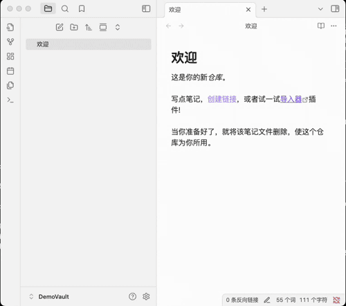
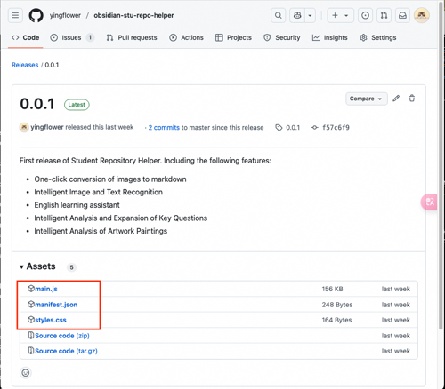
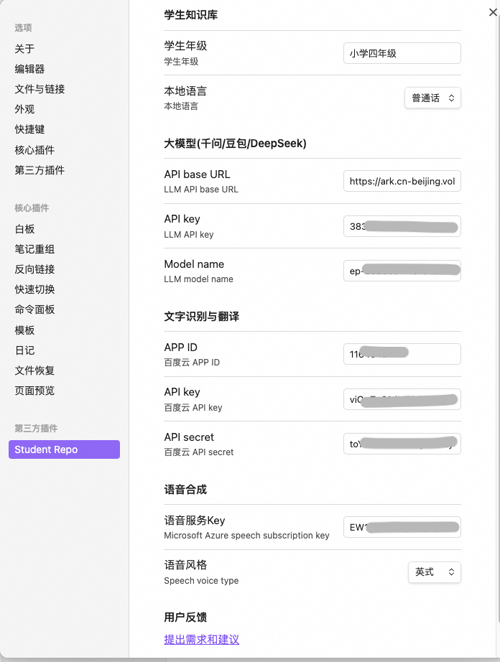

## Obsidian介绍
Obsidian是一款以本地优先、Markdown 驱动的知识管理工具。它的核心特点：
- **数据与软件分离**：采用Markdown格式存储笔记数据，兼容性强，易于迁移和备份；
- **本地优先**：所有数据存储在用户本地设备上，确保隐私和安全。
- **插件生态**：支持丰富的社区插件，可扩展功能以满足个性化需求。
- **多平台支持**：支持 Windows、macOS、Linux 以及移动端（iOS、Android）。
- **多端实时共享**：支持手机、PC、平板多端之间实时共享知识库数据，随时随地访问知识，学习不受限；

## 新建一个知识库
在Obsidian中，我们可以通过创建一个知识库来存储我们的数据。


打开刚创建的知识库文件夹目录，我们可以看到知识库的目录结构：

```shell
├── .obsidian
│   ├── app.json
│   ├── appearance.json
│   ├── core-plugins.json
│   ├── graph.json
│   └── workspace.json
└── 欢迎.md
```
.obsidian文件夹是Obsidian内部使用的文件夹，其中包含 Obsidian 的配置文件，欢迎.md是 Obsidian 默认创建的欢迎页。接下来我们在Obsidian创建的所有文件夹和笔记都会保存到这个文件夹。

## 学生知识库必备插件

### [Student Repository Helper](https://github.com/yingflower/obsidian-stu-repo-helper)
学生知识库助手（Student Repository Helper）是一个面向学生或学生家长的Obsidian 插件，这款插件旨在解决学生在学习阶段面临的资料管理难题，将学习过程中产生的各类重要资料，如试卷、笔记、关键文档等，进行系统性的数字化整合与管理，并利用 AI 助手定期进行学习分析总结。随着时间的推移，它将助力你逐步搭建起一座专属你自己的知识宝库，这座宝库将伴随你一生，成为你知识成长与积累的坚实见证。

### [Remotely Save](https://github.com/remotely-save/remotely-save)
Remotely Save这款插件能帮助我们实现多端实时共享。它通过智能冲突处理实现本地与云端笔记同步：支持 S3（亚马逊 S3/Cloudflare R2/Backblaze B2 等）、Dropbox、WebDAV（NextCloud/InfiniCLOUD/ 群晖等）、OneDrive、谷歌云端硬盘（GDrive）、Box、pCloud、Yandex Disk、Koofr、Azure Blob 存储 。

## 安装插件
有Obsidian官方插件市场和手动安装两种安装方式，下面以Student Repository Helper为例告诉大家如何安装Obsidian插件。
### 官方插件市场安装
首先，需要确保Obsidian官方插件市场可以访问，这时可以直接使用插件市场安装插件，如下图所示：

 

### 手动安装
由于国内用户无法直接访问Obsidian官方插件市场，需要自己先到插件github地址去下载安装包，然后自己手动安装。
- 第一步：下载插件包

打开插件[github地址](https://github.com/yingflower/obsidian-stu-repo-helper) ，再右下方Release中下载最新版本的插件：main.js, manifest.json, styles.css 这三个文件。



- 第二步：安装插件
在你刚才新建的知识库的.obsidian文件夹中，创建一个plugins文件夹（如果目录已经存在则忽略），再在plugins目录下创建stu-repo-helper文件夹，最后将第一步下载的3个文件放入stu-repo-helper目录，完成后的.obsidian目录结构如下：
```shell
.
├── app.json
├── appearance.json
├── community-plugins.json
├── core-plugins.json
├── graph.json
├── plugins
│   └── stu-repo-helper
│       ├── main.js
│       ├── manifest.json
│       └── styles.css
└── workspace.json
```
完成后重启Obsidian，再到设置中的第三方插件中，启用Student Repo，即可使用。

按照同样的步骤安装Remotely Save。全部安装成功后的plugins目录结构如下：
```shell
.
├── remotely-save
│   ├── data.json
│   ├── main.js
│   ├── manifest.json
│   └── styles.css
└── stu-repo-helper
    ├── data.json
    ├── main.js
    ├── manifest.json
    └── styles.css
```
其中remotely-save和stu-repo-helper是插件目录下的data.json文件是插件的配置文件。

## 插件配置
### Remotely Save 配置
Remotely Save 这个插件是用来实现多端实时共享的，它依赖一个远程存储服务，这里我们以支持WebDAV的InfiniCLOUD为例，向大家介绍如何申请InfiniCLOUD的账号和获取access key。选用InfiniCLOUD是因为它可以免费给每个账户提供至少25G的存储空间，以一个人正常学习过程中一年产生1G数据的速度来讲，25G可以用25年，足够满足我们日常学习的需求。

- 参照[开通InfiniCLOUD WebDAV服务指南](https://github.com/yingflower/obsidian-stu-repo-helper/blob/master/docs/%E5%BC%80%E9%80%9AInfiniCLOUD%20WebDAV%E6%9C%8D%E5%8A%A1%E6%8C%87%E5%8D%97.md)，注册并开通InfiniCLOUD WebDAV服务。
- 配置Remotely Save：打开Obsidian，到设置中的第三方插件中，启用Remotely Save，点击插件的设置，将上一步保存的WebDAV配置信息填入。


### Student Repository Helper 配置
#### AI服务账号申请

知识库搭建过程中会用到的一些AI服务，其对应的账号申请链接如下，请大家按需申请：

**大语言模型** ：
- 字节豆包：[开通指南](https://github.com/yingflower/obsidian-stu-repo-helper/blob/master/docs/%E5%BC%80%E9%80%9A%E5%A4%A7%E6%A8%A1%E5%9E%8B%E6%9C%8D%E5%8A%A1%E6%8C%87%E5%8D%97.md#%E5%BC%80%E9%80%9A%E8%B1%86%E5%8C%85%E5%A4%A7%E6%A8%A1%E5%9E%8B%E6%9C%8D%E5%8A%A1%E8%B4%A6%E5%8F%B7)
- Deepseek：[开通指南](https://github.com/yingflower/obsidian-stu-repo-helper/blob/master/docs/%E5%BC%80%E9%80%9A%E5%A4%A7%E6%A8%A1%E5%9E%8B%E6%9C%8D%E5%8A%A1%E6%8C%87%E5%8D%97.md#%E5%BC%80%E9%80%9Adeepseek%E5%A4%A7%E6%A8%A1%E5%9E%8B%E6%9C%8D%E5%8A%A1%E8%B4%A6%E5%8F%B7)
- 阿里通义千问：[开通指南](https://github.com/yingflower/obsidian-stu-repo-helper/blob/master/docs/%E5%BC%80%E9%80%9A%E5%A4%A7%E6%A8%A1%E5%9E%8B%E6%9C%8D%E5%8A%A1%E6%8C%87%E5%8D%97.md#%E5%BC%80%E9%80%9A%E5%8D%83%E9%97%AE%E5%A4%A7%E6%A8%A1%E5%9E%8B%E6%9C%8D%E5%8A%A1%E8%B4%A6%E5%8F%B7)

**文字识别**：
- 百度云通用文字识别（高精度版）：[开通指南](https://github.com/yingflower/obsidian-stu-repo-helper/blob/master/docs/%E5%BC%80%E9%80%9A%E7%99%BE%E5%BA%A6%E4%BA%91%E6%96%87%E5%AD%97%E8%AF%86%E5%88%AB%E6%9C%8D%E5%8A%A1%E6%8C%87%E5%8D%97.md)

**语音合成**：
- 微软Azure：[开通指南](https://github.com/yingflower/obsidian-stu-repo-helper/blob/master/docs/%E5%BC%80%E9%80%9A%E5%BE%AE%E8%BD%AFAzure%E8%AF%AD%E9%9F%B3%E6%9C%8D%E5%8A%A1%E6%8C%87%E5%8D%97.md)

#### 插件配置
打开Obsidian，到设置中的第三方插件中，启用Student Repo，点击插件的设置，输入你的 AI 服务提供商的账号信息，示例如下图：



**注意**： 如果你需要使用绘画分析的功能，那么需要申请并配置一个支持多模态的大模型。否则只需要配置一个支持文本的大模型即可。

至此，学生知识库必备插件就安装配置完成。接下来我们就可以开始按照自己的需求来构建学生知识库了。