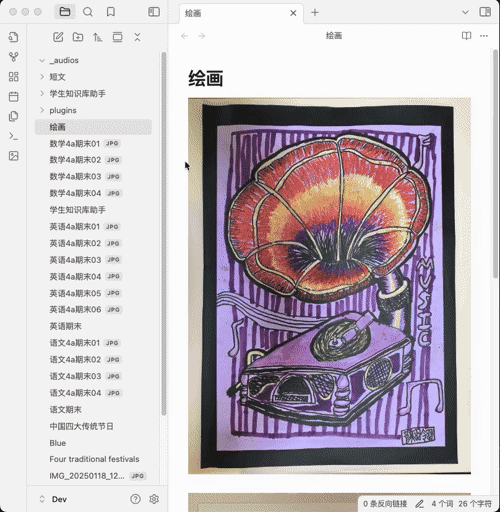

# Building a Student Knowledge Repository

Building a knowledge repository is a long-term process. The function of the Student knowledge repository Helper plugin is to simplify some of the cumbersome operations encountered during this process, allowing students to use the saved time for learning. Next, we will introduce some common operations in the process of building the knowledge repository.

### One-click Image Conversion
During the process of converting an image into a Markdown document, the plugin will add the images to the Markdown in the order of their shooting time. Therefore, please take photos in accordance with the page order.

### Image and Text Recognition
During the learning process, there is often a need to extract text from test paper images for subsequent in - depth analysis and learning. This plugin supports one - click image - text recognition. The operation method is as follows:

### Voiceover for English Essays
When you come across an English essay that is suitable for children to read and recite, you can save it in the knowledge base. This plugin supports converting the selected text into audio and skillfully embedding it into the corresponding text. In this way, children can make use of their fragmented time anytime and anywhere, listening to professional readings while learning and memorizing the content of the essay. In addition, the plugin thoughtfully provides the option to switch between British pronunciation and American pronunciation to meet diverse learning needs.

### Text Translation

### English New Word Bank Management
During the process of English learning, when you encounter unfamiliar new words, you can add them to the word bank of this plugin. The word bank manages new words in chronological order and can also be associated with the essay in which the new word appears. Learners can combine the original context of the new word to have a more thorough understanding of the word's meaning and usage, thus enhancing the memorization effect.

 

### English Grammar Analysis
When you encounter unfamiliar English sentence patterns, you can take advantage of the powerful grammar analysis function of this plugin. Relying on advanced large model technology, it can quickly analyze the structure of the sentence patterns and clearly explain their meanings, helping you thoroughly understand complex sentence structures and easily overcome grammar difficulties.

 

### Intelligent Analysis and Expansion of Key Questions
For some error-prone or key question types, this plugin provides an intelligent analysis and expansion function. It automatically extracts the knowledge points of the questions and generates new related questions according to the characteristics of the question types, helping students strengthen their learning effects and deepen their understanding of knowledge. 

### Analysis of Artwork and Handicrafts
This plugin supports the automatic generation of names and descriptions for students' artwork paintings and handicrafts, which facilitates subsequent management and retrieval. In this way, every precious creation can be properly preserved and efficiently utilized.

 

## Planned Features:

- Retrieval of knowledge repository content;
- Collection of user feedback. 