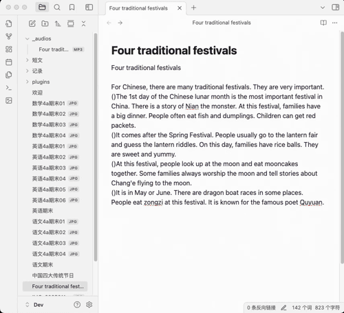

# 构建学生知识库

构建知识库是一个长期的过程，学生知识库助手这个插件的作用是把这个过程中遇到的一些比较繁琐的操作简化，把节省下来的时间用于学习，接下来会将建库过程中的一些常见的操作介绍给大家。

### 图片一键转档
图片转成markdown的过程中，插件会根据图片的拍摄时间按顺序将其加入markdown中，所以拍摄时请按照页面顺序进行拍摄。

### 图文识别
在学习过程中，时常会有从试卷图片中提取文字的需求，以便进行后续深入分析与学习。本插件支持一键图片文字识别，操作方式如下：

### 英文短文配音
遇到适合小朋友阅读和背诵的英语短文，可以保存到知识库内。本插件支持将选中的文本转换为音频，并巧妙嵌入到对应文本之中。如此一来，小朋友能够随时随地利用碎片化时间，一边聆听专业朗读，一边学习与记忆短文内容。此外，插件贴心提供英式发音与美式发音的切换选项，满足多样化学习需求。

### 英语文本翻译
英语学习过程中遇到的生词和不理解的句子，我们可以一键翻译成中文：

### 英语生词库管理
英语学习过程中，遇到不认识的生词，可以将其加入本插件单词库中，单词库按照时间顺序管理生词，还可以关联到出现这一生词的短文，学习者能够结合生词的原文语境，更透彻地理解词汇含义与用法，加深记忆效果。

### 英语语法分析
遇到陌生的英语句型，可借助本插件强大的语法分析功能，依托先进的大模型技术，迅速剖析句型结构，清晰阐释句型含义，帮助你透彻理解复杂句式，轻松攻克语法难点。

### 重点题目智能分析拓展
针对一些易错或重点题型，本插件提供智能分析拓展功能，自动提取题目知识点，并根据题型特征生成新的相关题目，帮助学生强化学习效果，加深知识理解。

### 绘画作品分析
本插件支持为学生的一些绘画和手工作品自动生成命名和描述，方便后期管理和检索，让每一份珍贵创作都能被妥善留存与高效利用。

# 规划中功能
- 知识库内容检索；