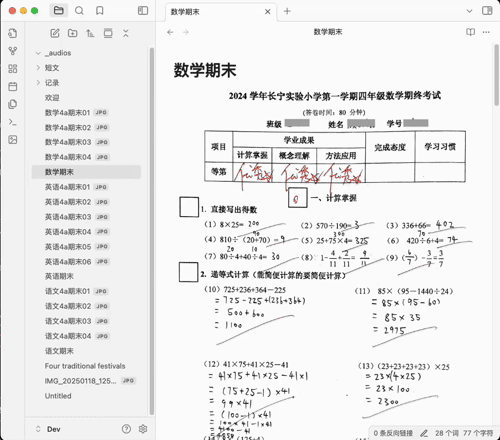

# 构建学生知识库

构建知识库是一个长期的过程，学生知识库助手这个插件的作用是把这个过程中遇到的一些比较繁琐的操作简化，把节省下来的时间用于学习，接下来会将建库过程中的一些常见的操作介绍给大家。

## 试卷图片一键转档
当我们把试卷的图片上传到学生知识库后，就可以一键转档成 Obsidian 笔记，完成试卷的数字化存档，方便后续的查询和分析。操作方式如下图所示:

## 图文识别转换
有些时候我们会需要把试卷图片上的文字提取出来，便于后续的分析和学习。图片文字提取的操作方式如下图所示:

## 英文短文配音
遇到一些适合小朋友朗读和背诵的英文美文，我们可以一键转成语音，方便小朋友进行跟读和学习：

## 英语文本翻译
英语学习过程中遇到的生词和不理解的句子，我们可以一键翻译成中文：

## 英语生词管理
英语学习过程中遇到不认识单词，也可以一键添加到生词本中：

## 英语语法分析
对于一些长句子，我们可以一键分析其语法结构，帮助小朋友进行语法学习：

## 题目智能分析拓展
对于一些错题，我们可以分析其涵盖的知识点，并进行题目扩展，帮助小朋友对知识进行巩固学习：

## 规划中功能：

- 知识库内容检索；
- 英语生词库集中管理；
- 图片文字描述自动生成；
- 用户反馈意见收集