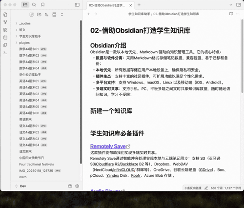

# Personal Knowledge Base - the external storage of the human brain

In the growth process of each person, we accumulate a large number of memories, which gradually converge into a personal - exclusive "knowledge base". However, the storage capacity of the brain is limited and cannot preserve all information without limit. Therefore, we need to rely on external storage to carry these memories. If we can achieve access at any time and retrieve information whenever we need it, then the brain and the external knowledge base can work in tandem, greatly expanding our memory capacity. 

# Student Repository - The Beginning of Personal Knowledge Base
The student identity is the main identity of everyone in the first 25 years of their life. The knowledge base during the student - stage is the starting point of a person's lifelong knowledge base. The earlier you start building your knowledge base, the more complete your knowledge system will be. 

Now, we will show you how to build a Student Repository that can grow with us with the help of Obsidian and online AI services. 

A typical Student Repository usually contains the following parts:
- Study records: cover learning materials for each course, such as test papers, notes, important documents, etc. 
- Daily records: including records of extracurricular activities such as painting and handicrafts. 

Below is a typical example of the composition of a student knowledge - base directory: 
```shell
├── 01_语文
│   ├── 4a
│   │   ├── 作文
│   │   │   ├── 一起游宏村.md
│   │   │   └── 宣布成绩日.md
│   │   └── 试卷
│   │       ├── 三四单元练习.md
│   │       └── 五六单元练习.md
│   └── _imgs
├── 02_数学
│   ├── 4a
│   │   ├── 试卷
│   │   │   ├── 33-期终复习02.md
│   │   │   └── 34-期末考试.md
│   │   └── 基础练习
│   │   │   ├── 基础练习_01.md
│   │   │   └── 基础练习_02.md
│   └── _imgs
├── 03_English
│   └──  4a
│       ├── _imgs
│       ├── 短文
│       │   ├── Animals in the forest.md
│       │   ├── Blue Dream Island.md
│       │   └── _audios
│       │       ├── Animals in the forest.mp3
│       │       └── Blue Dream Island.mp3
│       ├── 试卷
│       │   ├── m4p2.md
│       │   └── m4p3.md
│       └── 默写
│           ├── m3u3.md
│           └── m4u1.md
└── 04_绘画存档
    ├── 2024绘画记.md
    ├── 2025绘画记.md
    └── _imgs
        ├── IMG_2023_菜篮子.jpg
        └── 青岛游小报.jpg
```

Now, we will tell you step - by - step how to conveniently and quickly put the daily - generated data into the knowledge base for our subsequent processing. 

# Obsidian Vault Creation and Plugin Installation

## Obsidian Introduction
Obsidian is a local - first, Markdown - driven knowledge management tool. Its core features are: 
- **Separation of data and software**：The note - taking data is stored in Markdown format, which has strong compatibility and is easy to migrate and back up. 
- **Local - first**：All data is stored on the user's local device to ensure privacy and security.
- **Plugin Ecosystem**：Supports a rich variety of community - based plugins, and the functions can be extended to meet personalized needs. 
- **Multi - platform support**：Supports Windows, macOS, Linux, and mobile devices (iOS, Android). 
- **Multi - end real - time sharing**：It supports real - time sharing of knowledge base data among mobile phones, PCs and tablets, allowing users to access knowledge anytime and anywhere, with no limitations on learning. 

## Create a new vault
In Obsidian, we can store our data by creating a Vault.



Open the directory of the newly - created knowledge base folder, and we can see the directory structure of the knowledge base: 

```shell
├── .obsidian
│   ├── app.json
│   ├── appearance.json
│   ├── core-plugins.json
│   ├── graph.json
│   └── workspace.json
└── 欢迎.md
```
The.obsidian folder is a folder used internally by Obsidian, which contains Obsidian's configuration files. welcome.md is the welcome page that Obsidian creates by default. All the folders and notes we create in Obsidian next will be saved to this folder. 

## Essential plugins for Student Repository

### [Student Repository Helper](https://github.com/yingflower/obsidian-stu-repo-helper)
he Student Repository Helper is an Obsidian plugin aimed at students or parents of students. This plugin is designed to solve the challenges students face in managing study materials during their learning stages. It systematically digitizes, integrates, and manages various important materials generated during the learning process, such as test papers, notes, key documents, etc., and uses an AI - assistant to regularly conduct learning analysis and summaries. Over time, it will help you gradually build a knowledge treasure - house exclusive to you. This treasure - house will accompany you throughout your life and serve as a solid testament to your knowledge growth and accumulation. 

### [Remotely Save](https://github.com/remotely-save/remotely-save)
The Remotely Save plugin can help us achieve real - time sharing across multiple devices. It synchronizes local and cloud notes through intelligent conflict handling: supporting S3 (such as Amazon S3/Cloudflare R2/Backblaze B2, etc.), Dropbox, WebDAV (NextCloud/InfiniCLOUD/Synology, etc.), OneDrive, Google Drive (GDrive), Box, pCloud, Yandex Disk, Koofr, Azure Blob Storage. 

## Install the plugin
There are two installation methods: the official Obsidian plugin market and manual installation. Below, take the Student Repository Helper as an example to show you how to install Obsidian plugins. 
### Install from the official plugin market
First, it is necessary to ensure that the official Obsidian plugin market can be accessed. At this time, plugins can be directly installed using the plugin market, as shown in the following figure: 

 

### Manual installation
Since domestic users cannot directly access the official Obsidian plugin market, they need to first download the installation package from the plugin's GitHub address and then install it manually. 
- Step 1: Download the plugin package

Open the plugin [GitHub address](https://github.com/yingflower/obsidian-stu-repo-helper), and then download the latest - version plugin files: main.js, manifest.json, and styles.css from the Release section at the bottom - right. 


- Step 2: Install the plugin
Create a "plugins" folder in the ".obsidian" folder of the knowledge - base you just created (ignore it if the directory already exists). Then create a "stu - repo - helper" folder under the "plugins" directory. Finally, put the three files downloaded in the first step into the "stu - repo - helper" directory. The completed ".obsidian" directory structure is as follows: 
```shell
.
├── app.json
├── appearance.json
├── community-plugins.json
├── core-plugins.json
├── graph.json
├── plugins
│   └── stu-repo-helper
│       ├── main.js
│       ├── manifest.json
│       └── styles.css
└── workspace.json
```
After completion, restart Obsidian. Then, in the third - party plugins section of the settings, enable Student Repo to start using it. 

按照同样的步骤安装Remotely Save。全部安装成功后的plugins目录结构如下：
```shell
.
├── remotely-save
│   ├── data.json
│   ├── main.js
│   ├── manifest.json
│   └── styles.css
└── stu-repo-helper
    ├── data.json
    ├── main.js
    ├── manifest.json
    └── styles.css
```
其中remotely-save和stu-repo-helper是插件目录下的data.json文件是插件的配置文件。

## Plugin Configuration
### Remotely Save Configuration
The Remotely Save plugin is used to achieve real - time sharing across multiple devices. It relies on a remote storage service. Here, we take InfiniCLOUD, which supports WebDAV, as an example to introduce to you how to apply for an InfiniCLOUD account and obtain the access key. InfiniCLOUD is chosen because it can provide each account with at least 25GB of storage space for free. Taking the speed at which a person generates 1GB of data in a normal one - year learning process as an example, 25GB can be used for 25 years, which is sufficient to meet our daily learning needs. 

- Refer to the [InfiniCLOUD WebDAV Service Activation Guide](https://github.com/yingflower/obsidian-stu-repo-helper/blob/master/docs/%E5%BC%80%E9%80%9AInfiniCLOUD%20WebDAV%E6%9C%8D%E5%8A%A1%E6%8C%87%E5%8D%97.md) to register and activate the InfiniCLOUD WebDAV service. 
- Configure Remotely Save: Open Obsidian, go to the third - party plugins in the settings, enable Remotely Save, click on the plugin's settings, and fill in the WebDAV configuration information saved in the previous step. 


### Student Repository Helper Configuration
#### AI service account application

Some AI services used in the process of knowledge - base construction. The corresponding account application links are as follows. Please apply as needed: 

**Large Language Model** ：
- Doubao：[Guide](https://github.com/yingflower/obsidian-stu-repo-helper/blob/master/docs/%E5%BC%80%E9%80%9A%E5%A4%A7%E6%A8%A1%E5%9E%8B%E6%9C%8D%E5%8A%A1%E6%8C%87%E5%8D%97.md#%E5%BC%80%E9%80%9A%E8%B1%86%E5%8C%85%E5%A4%A7%E6%A8%A1%E5%9E%8B%E6%9C%8D%E5%8A%A1%E8%B4%A6%E5%8F%B7)
- Deepseek：[Guide](https://github.com/yingflower/obsidian-stu-repo-helper/blob/master/docs/%E5%BC%80%E9%80%9A%E5%A4%A7%E6%A8%A1%E5%9E%8B%E6%9C%8D%E5%8A%A1%E6%8C%87%E5%8D%97.md#%E5%BC%80%E9%80%9Adeepseek%E5%A4%A7%E6%A8%A1%E5%9E%8B%E6%9C%8D%E5%8A%A1%E8%B4%A6%E5%8F%B7)
- Qwen：[Guide](https://github.com/yingflower/obsidian-stu-repo-helper/blob/master/docs/%E5%BC%80%E9%80%9A%E5%A4%A7%E6%A8%A1%E5%9E%8B%E6%9C%8D%E5%8A%A1%E6%8C%87%E5%8D%97.md#%E5%BC%80%E9%80%9A%E5%8D%83%E9%97%AE%E5%A4%A7%E6%A8%A1%E5%9E%8B%E6%9C%8D%E5%8A%A1%E8%B4%A6%E5%8F%B7)

**OCR**：
- Baidu OCR：[Guide](https://github.com/yingflower/obsidian-stu-repo-helper/blob/master/docs/%E5%BC%80%E9%80%9A%E7%99%BE%E5%BA%A6%E4%BA%91%E6%96%87%E5%AD%97%E8%AF%86%E5%88%AB%E6%9C%8D%E5%8A%A1%E6%8C%87%E5%8D%97.md)

**Text to Speech**：
- Microsoft Azure：[Guide](https://github.com/yingflower/obsidian-stu-repo-helper/blob/master/docs/%E5%BC%80%E9%80%9A%E5%BE%AE%E8%BD%AFAzure%E8%AF%AD%E9%9F%B3%E6%9C%8D%E5%8A%A1%E6%8C%87%E5%8D%97.md)

#### Plugin Configuration
Open Obsidian, go to the third - party plugins in the settings, enable Student Repo, click on the plugin's settings, and enter the account information of your AI service provider. An example is shown in the figure below:


**Note**： If you need to use the function of painting analysis, you need to apply for and configure a large model that supports multimodality. Otherwise, you only need to configure a large model that supports text.

Now, we can start building a Student Repository according to our own needs.

# Build Student Repository

Building a Student Repository is a long - term process. The function of the "Student Knowledge Base Assistant" plugin is to simplify some of the more cumbersome operations encountered in this process, so that the saved time can be used for learning. Next, some common operations in the process of building the knowledge base will be introduced to you.

### One-click conversion of pictures to documents
During the process of converting pictures to Markdown, the plugin will add the pictures to the Markdown file in order according to their shooting times. Therefore, please take the pictures in the order of the pages when taking them.


### OCR
During the learning process, there is often a need to extract text from test paper images for subsequent in - depth analysis and learning. This plugin supports one - click image text recognition, and the operation method is as follows: 


### Text to Speech
When you come across English essays suitable for children to read and recite, you can save them in the knowledge base. This plugin supports converting the selected text into audio and skillfully embedding it into the corresponding text. In this way, children can use fragmented time anytime and anywhere to learn and memorize the content of the essays while listening to professional readings. In addition, the plugin thoughtfully provides an option to switch between British and American pronunciations to meet diverse learning needs.


### Text Translation
We can translate the new words and incomprehensible sentences encountered during the English learning process into Chinese with one click.


### English Word Bank Management
During the English learning process, when you come across unfamiliar words, you can add them to the word bank of this plugin. The word bank manages new words in chronological order and can also be associated with the short passages where these words appear. Learners can combine the original context of the new words to understand the meanings and usages of the vocabulary more thoroughly and enhance the memory effect.


### English Grammar Analysis
When encountering unfamiliar English sentence patterns, you can leverage the powerful grammar analysis function of this plugin. Relying on advanced large - model technology, it can quickly analyze the structure of the sentence pattern, clearly explain its meaning, help you thoroughly understand complex sentence structures, and easily overcome grammar difficulties.


### Intelligent Analysis and Expansion of Key Questions
For some question types that are error - prone or of key importance, this plugin provides an intelligent analysis and expansion function. It automatically extracts the knowledge points of the questions, gives solutions, and generates new relevant questions based on the characteristics of the question types to help students strengthen their learning effects and deepen their understanding of knowledge.


### Analysis of Paintings
This plugin supports automatically generating names and descriptions for some of students' paintings and handicrafts, facilitating later management and retrieval, so that every precious creation can be properly preserved and efficiently utilized.


### How to Work on Mobile phones
Obsidian has a mobile version that can be used. However, its usage method is different from that of the desktop version, and not all plugins support the mobile version. The two plugins we use both support the mobile version, which makes it convenient for us to make full use of our fragmented time.

Now, I'll demonstrate several commonly used functions in English learning for you.


