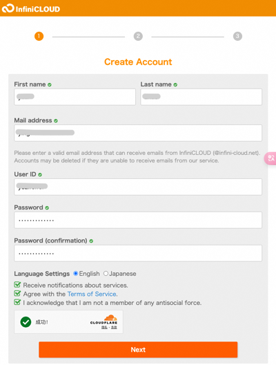
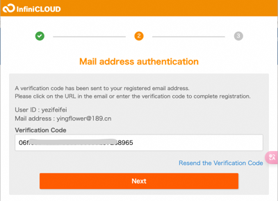
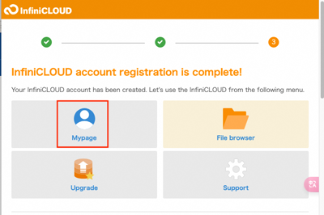
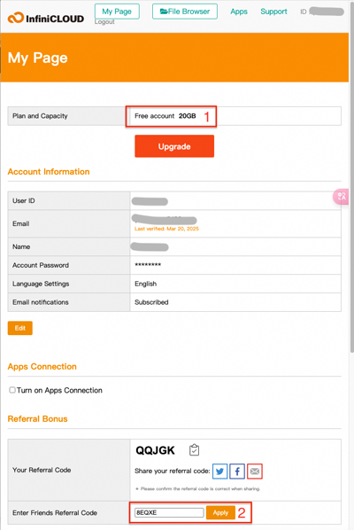
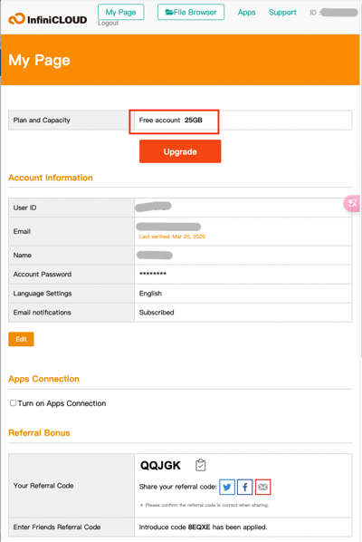
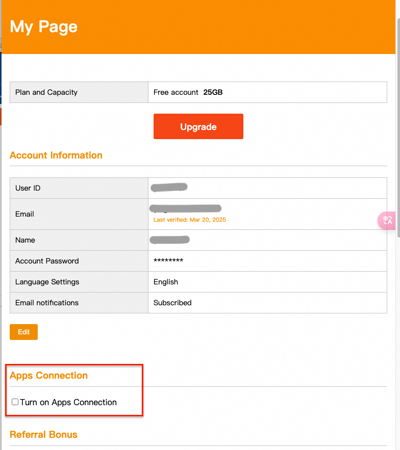
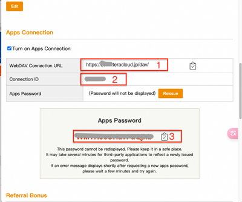

# 开通InfiniCLOUD WebDAV服务指南

## 注册InfiniCLOUD账号
打开[InfiniCLOUD主页](https://infini-cloud.net/en/)，点击"Create Account"，填入注册信息后点击“Next”。

打开刚才注册填入的邮箱，复制确认码，输入到InfiniCLOUD页面中，点击“Next”。

打开“Mypage”，并按照提示登录你的账号。

进入“My Page"后，可以在顶部看到你已经有了20G的免费空间。在页面底部找到“Enter Friends Referral Code”，填入邀请码“8EQXE”并确认，刷新页面可以看到你的免费空间增加到了25G。

## 开通WebDAV服务
接下来在页面的中间部分找到“Turn on Apps Connection”并勾选.

弹出窗口选择“Turn on”，等待一会后会显示出你的WebDAV配置信息，如下图所示，请将如下图红框中的3个参数拷贝出来，保存到一个保险的地方。这三个参数是配置Obsidian Remotely Save插件需要的。

