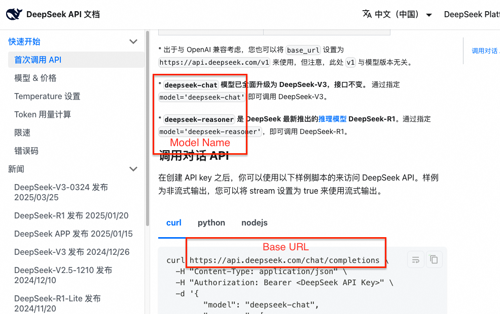

# 开通大模型服务指南

这里给大家介绍几个兼容OpenAI接口的大模型的注册方法，含：
- 豆包大模型
- Deepseek大模型
- 千问大模型

接下来给大家分别介绍如何注册这几个大模型账号

## 开通豆包大模型服务账号
打开[火山引擎控制台](https://console.volcengine.com/ark/) ，点击右下方的“现在就注册”，在“账号注册”页面输入账号信息完成注册，并登录。

下面以开通Doubao-1.5-lite-32k为例，介绍如何注册豆包大模型。

### 创建API Key
登录后在控制台页面左侧菜单中选择”系统管理“中的“API Key管理”，点击“创建API key”，再点击“创建”，即可创建成功。

点击“API Key“右侧的眼睛标志，即可查看API key，这个就是今后插件配置的API key。

### 开通模型

在左侧菜单中选择”系统管理“中的“开通管理”，点击“Doubao-1.5-lite-32k”右侧的“开通服务”。

进入开通页面后选择左下角的“我同意”，再点击右下角的“立即开通”后“提交”，即可开通成功。

### 创建接入点
继续在控制台页面左侧菜单中选择“模型推理”中的“在线推理”，点击“创建在线推理接入点”.

在创建接入点页面中，填写“接入点名称”，并选择刚才开通的“Doubao-1.5-lite-32k”，最后点击“确认接入”。

会进入到API调用的页面，往下拉到“Rest API调用示例”，会看到Model name和Base URL，这两个就是接下来插件配置的Model name和Base URL：

如果后面再想看到这个信息，只需要在控制台页面左侧菜单中选择“模型推理”中的“在线推理”，就能看到之前创建的所有接入点。

## 开通Deepseek大模型服务账号

打开[Deepseek开放平台](https://platform.deepseek.com/)，完成账号注册，并登录。

### 创建API Key
登录后在页面左侧菜单中选择”API keys“，点击“创建API key”，再输入API key名称，点击“创建”，即可创建成功。

把你的API key复制保存下来，这个就是接下来插件配置的API key。

### 获取Base URL和Model name
在页面左侧菜单中选择”接口文档“，查看Deepseek的Base URL和Model name：

至此，你就获取到了使用Deepseek大模型所需的3个配置：API key、Base URL和Model name。

## 开通千问大模型服务账号
打开[阿里云百炼](https://bailian.console.aliyun.com/)，完成账号注册，并登录。

### 创建API Key
点击页面右上角的小人标志，选择“API-KEY”。

进入API-KEY页面后，点击“创建我的API-KEY”，选择“默认业务空间”，点击“确定”即可创建成功。

退回到API-KEY页面后可以看到刚才创建的API-KEY，点击“查看”，复制API-KEY并保存。

### 获取Base URL和Model name
返回到百炼控制台首页，点击页左侧的“模型广场”，选择“通义”，找到你想要使用的模型，这里以“通义千问-Omni-Turbo”为例，点击模型下方的“API调用示例”。

进入后会看到Model name和Base URL，这两个就是接下来插件配置的Model name和Base URL：

至此，你就获取到了使用千问大模型所需的3个配置：API key、Base URL和Model name。
