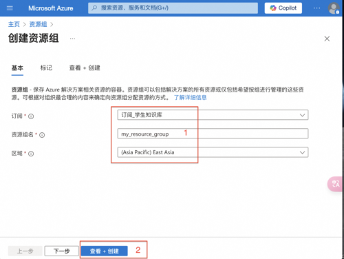

# 开通微软Azure语音服务指南

访问 [Azure官网](https://azure.microsoft.com/)，点击页面右上角的“开始使用Azure”按钮。

进入后可以选择”免费试用Azure“，或直接选择“即付即用”，选择免费试用30天到期后也可以再转为即付即用。这里以选择免费试用为例。

### 注册微软账号
接下来会进入登录页面，如果你已经有了微软账号，请使用您的微软账号登录。如果没有微软账号，请点击“创建一个”来注册一个新的微软账号。

按照提示填写您的个人信息，包括姓名、电子邮件地址、电话号码、支付信息等完成注册，Azure会对你提供的支付信息进行1美元的验证扣款，但不会实际收费。

接下来你就可以开始使用Azure的各种服务了。

### 创建订阅
登录进入Azure后，点击页面中的“订阅”按钮。

进入订阅页面后，点击“添加”，进入创建订阅页面，填入订阅名称，其他信息都用默认，完成后点击“评审+创建”。

点击“创建”按钮，创建订阅成功。

### 创建资源组
回到 Azure主页，点击页面中的“资源组”按钮，进入资源组管理页面。

点击“创建”按钮，进入创建资源组页面，选择刚才创建的订阅，填入资源组名称，区域选择East Asia，完成后点击“查看+创建”。

点击“创建”按钮，创建资源组成功。

### 创建语音资源
回到 Azure主页，点击页面中的“创建资源”按钮，进入创建资源页面，在页面左侧的“类别”中选择“AI + 机器学习“，点击“语音“下方的“创建”。

进入创建语音服务页面，填写语音服务名称，选择刚才创建的资源组和订阅，选择区域和定价层，点击“审阅并创建”。

点击“创建”按钮，创建语音资源成功。

### 查看语音接入点
回到 Azure主页，点击页面中的“所有资源“按钮，进入资源管理页面，找到刚才创建的语音资源，点击进入语音资源页面，找到“密钥和终结点”，将密钥1拷贝保存，这个就是后面插件配置时需要的Subscrition key。

