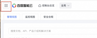
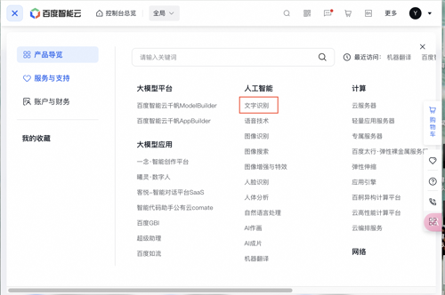
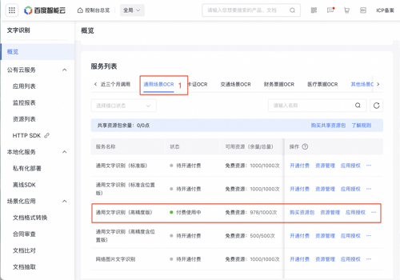
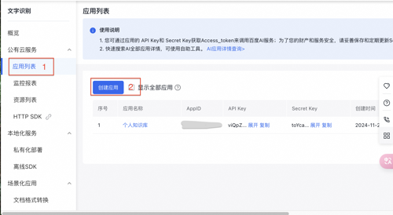
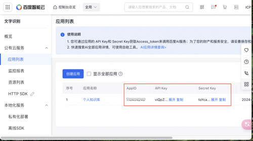

# 开通百度云文字识别服务指南

要使用百度云提供的文字识别服务，需要注册一个百度云账号。

打开[百度云控制台](https://console.bce.baidu.com/)，点击右上角"注册"，按照它的提示填入完成注册并登录。

接下来以开通文字识别服务为例，介绍如何开通服务。

## 开通文字识别服务
进入[百度云控制台](https://console.bce.baidu.com/)，点击左上角"产品与服务"，找到"文字识别"，点击进入。

选择“通用场景OCR”中的"通用文字识别（高精度版）"，点击右侧的”开通付费“，完成服务开通，之后每个月你可以免费识别1000张图片，如果有更多的识别需求，可以购买付费服务。

## 创建应用
在文字识别页面左侧菜单中选择"应用列表"，点击"创建应用"，输入应用名称和应用描述，点击"创建"，完成应用创建。

按照提示填入应用名称，”接口选择中“选择之前开通的”通用文字识别（高精度版）“，”应用归属“选择个人，填入“应用描述”，点击"立即创建"，完成应用创建。

返回应用列表，可以看到刚才创建的应用信息，包含：AppID，API Key，Secret Key，拷贝并保存下来，这三个参数都是插件配置的必要参数。

