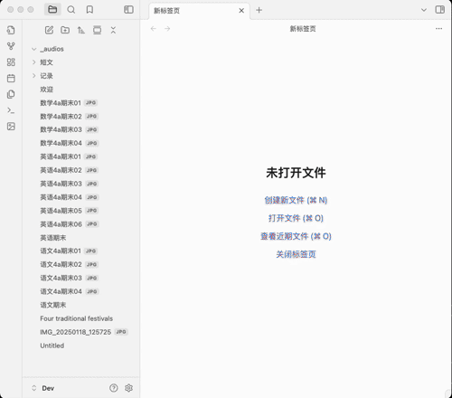
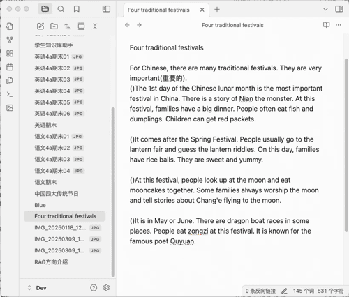
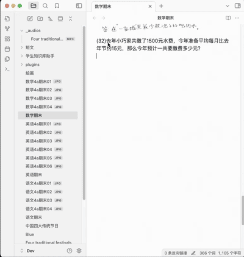

# 个人知识库--人类大脑的外部存储

在每个人的成长过程中，我们会积累大量的记忆，这些记忆逐渐汇聚成一个专属于个人的“知识库”。然而，大脑的存储容量是有限的，无法无限制地保存所有信息，因此我们需要借助外部存储来承载这些记忆。如果能够实现随时存取、随用随取，那么大脑与外部知识库就能协同工作，极大地扩展我们的记忆容量。

# 学生知识库--个人知识库的起点

学生身份是每个人人生前25年的主要身份，学生阶段的知识库是一个人一生的知识库的起点，越早开始你的知识库的搭建，你的知识体系将越完整。

接下来，我们向大家展示如何借助Obsidian和在线AI服务，搭建一个可与我们一同成长的学生知识库。

一个典型的学生知识库通常包含以下几个部分：
- 学习记录：涵盖每一门课程的学习资料，如试卷、笔记、重要文档等。
- 日常记录：包括绘画、手工等课外活动的记录。

下面是一个典型的学生知识库目录组成示例：
```shell
├── 01_语文
│   ├── 4a
│   │   ├── 作文
│   │   │   ├── 一起游宏村.md
│   │   │   └── 宣布成绩日.md
│   │   └── 试卷
│   │       ├── 三四单元练习.md
│   │       └── 五六单元练习.md
│   └── _imgs
├── 02_数学
│   ├── 4a
│   │   ├── 试卷
│   │   │   ├── 33-期终复习02.md
│   │   │   └── 34-期末考试.md
│   │   └── 基础练习
│   │   │   ├── 基础练习_01.md
│   │   │   └── 基础练习_02.md
│   └── _imgs
├── 03_English
│   └──  4a
│       ├── _imgs
│       ├── 短文
│       │   ├── Animals in the forest.md
│       │   ├── Blue Dream Island.md
│       │   └── _audios
│       │       ├── Animals in the forest.mp3
│       │       └── Blue Dream Island.mp3
│       ├── 试卷
│       │   ├── m4p2.md
│       │   └── m4p3.md
│       └── 默写
│           ├── m3u3.md
│           └── m4u1.md
└── 04_绘画存档
    ├── 2024绘画记.md
    ├── 2025绘画记.md
    └── _imgs
        ├── IMG_2023_菜篮子.jpg
        └── 青岛游小报.jpg
```

接下来，我们将一步步告诉大家怎么能方便快捷的把日常产生的数据放入知识库中，方便我们做后续的处理。

# Obsidian知识库创建与插件安装

## Obsidian介绍
Obsidian是一款以本地优先、Markdown 驱动的知识管理工具。它的核心特点：
- **数据与软件分离**：采用Markdown格式存储笔记数据，兼容性强，易于迁移和备份；
- **本地优先**：所有数据存储在用户本地设备上，确保隐私和安全。
- **插件生态**：支持丰富的社区插件，可扩展功能以满足个性化需求。
- **多平台支持**：支持 Windows、macOS、Linux 以及移动端（iOS、Android）。
- **多端实时共享**：支持手机、PC、平板多端之间实时共享知识库数据，随时随地访问知识，学习不受限；

## 新建一个知识库
在Obsidian中，我们可以通过创建一个知识库来存储我们的数据。


打开刚创建的知识库文件夹目录，我们可以看到知识库的目录结构：

```shell
├── .obsidian
│   ├── app.json
│   ├── appearance.json
│   ├── core-plugins.json
│   ├── graph.json
│   └── workspace.json
└── 欢迎.md
```
.obsidian文件夹是Obsidian内部使用的文件夹，其中包含 Obsidian 的配置文件，欢迎.md是 Obsidian 默认创建的欢迎页。接下来我们在Obsidian创建的所有文件夹和笔记都会保存到这个文件夹。

## 学生知识库必备插件

### [Student Repository Helper](https://github.com/yingflower/obsidian-stu-repo-helper)
学生知识库助手（Student Repository Helper）是一个面向学生或学生家长的Obsidian 插件，这款插件旨在解决学生在学习阶段面临的资料管理难题，将学习过程中产生的各类重要资料，如试卷、笔记、关键文档等，进行系统性的数字化整合与管理，并利用 AI 助手定期进行学习分析总结。随着时间的推移，它将助力你逐步搭建起一座专属你自己的知识宝库，这座宝库将伴随你一生，成为你知识成长与积累的坚实见证。

### [Remotely Save](https://github.com/remotely-save/remotely-save)
Remotely Save这款插件能帮助我们实现多端实时共享。它通过智能冲突处理实现本地与云端笔记同步：支持 S3（亚马逊 S3/Cloudflare R2/Backblaze B2 等）、Dropbox、WebDAV（NextCloud/InfiniCLOUD/ 群晖等）、OneDrive、谷歌云端硬盘（GDrive）、Box、pCloud、Yandex Disk、Koofr、Azure Blob 存储 。

## 安装插件
有Obsidian官方插件市场和手动安装两种安装方式，下面以Student Repository Helper为例告诉大家如何安装Obsidian插件。
### 官方插件市场安装
首先，需要确保Obsidian官方插件市场可以访问，这时可以直接使用插件市场安装插件，如下图所示：

 

### 手动安装
由于国内用户无法直接访问Obsidian官方插件市场，需要自己先到插件github地址去下载安装包，然后自己手动安装。
- 第一步：下载插件包

打开插件[github地址](https://github.com/yingflower/obsidian-stu-repo-helper) ，再右下方Release中下载最新版本的插件：main.js, manifest.json, styles.css 这三个文件。


- 第二步：安装插件
在你刚才新建的知识库的.obsidian文件夹中，创建一个plugins文件夹（如果目录已经存在则忽略），再在plugins目录下创建stu-repo-helper文件夹，最后将第一步下载的3个文件放入stu-repo-helper目录，完成后的.obsidian目录结构如下：
```shell
.
├── app.json
├── appearance.json
├── community-plugins.json
├── core-plugins.json
├── graph.json
├── plugins
│   └── stu-repo-helper
│       ├── main.js
│       ├── manifest.json
│       └── styles.css
└── workspace.json
```
完成后重启Obsidian，再到设置中的第三方插件中，启用Student Repo，即可使用。

按照同样的步骤安装Remotely Save。全部安装成功后的plugins目录结构如下：
```shell
.
├── remotely-save
│   ├── data.json
│   ├── main.js
│   ├── manifest.json
│   └── styles.css
└── stu-repo-helper
    ├── data.json
    ├── main.js
    ├── manifest.json
    └── styles.css
```
其中remotely-save和stu-repo-helper是插件目录下的data.json文件是插件的配置文件。

## 插件配置
### Remotely Save 配置
Remotely Save 这个插件是用来实现多端实时共享的，它依赖一个远程存储服务，这里我们以支持WebDAV的InfiniCLOUD为例，向大家介绍如何申请InfiniCLOUD的账号和获取access key。选用InfiniCLOUD是因为它可以免费给每个账户提供至少25G的存储空间，以一个人正常学习过程中一年产生1G数据的速度来讲，25G可以用25年，足够满足我们日常学习的需求。

- 参照[开通InfiniCLOUD WebDAV服务指南](https://github.com/yingflower/obsidian-stu-repo-helper/blob/master/docs/%E5%BC%80%E9%80%9AInfiniCLOUD%20WebDAV%E6%9C%8D%E5%8A%A1%E6%8C%87%E5%8D%97.md)，注册并开通InfiniCLOUD WebDAV服务。
- 配置Remotely Save：打开Obsidian，到设置中的第三方插件中，启用Remotely Save，点击插件的设置，将上一步保存的WebDAV配置信息填入。


### Student Repository Helper 配置
#### AI服务账号申请

知识库搭建过程中会用到的一些AI服务，其对应的账号申请链接如下，请大家按需申请：

**大语言模型** ：
- 字节豆包：[开通指南](https://github.com/yingflower/obsidian-stu-repo-helper/blob/master/docs/%E5%BC%80%E9%80%9A%E5%A4%A7%E6%A8%A1%E5%9E%8B%E6%9C%8D%E5%8A%A1%E6%8C%87%E5%8D%97.md#%E5%BC%80%E9%80%9A%E8%B1%86%E5%8C%85%E5%A4%A7%E6%A8%A1%E5%9E%8B%E6%9C%8D%E5%8A%A1%E8%B4%A6%E5%8F%B7)
- Deepseek：[开通指南](https://github.com/yingflower/obsidian-stu-repo-helper/blob/master/docs/%E5%BC%80%E9%80%9A%E5%A4%A7%E6%A8%A1%E5%9E%8B%E6%9C%8D%E5%8A%A1%E6%8C%87%E5%8D%97.md#%E5%BC%80%E9%80%9Adeepseek%E5%A4%A7%E6%A8%A1%E5%9E%8B%E6%9C%8D%E5%8A%A1%E8%B4%A6%E5%8F%B7)
- 阿里通义千问：[开通指南](https://github.com/yingflower/obsidian-stu-repo-helper/blob/master/docs/%E5%BC%80%E9%80%9A%E5%A4%A7%E6%A8%A1%E5%9E%8B%E6%9C%8D%E5%8A%A1%E6%8C%87%E5%8D%97.md#%E5%BC%80%E9%80%9A%E5%8D%83%E9%97%AE%E5%A4%A7%E6%A8%A1%E5%9E%8B%E6%9C%8D%E5%8A%A1%E8%B4%A6%E5%8F%B7)

**文字识别**：
- 百度云通用文字识别（高精度版）：[开通指南](https://github.com/yingflower/obsidian-stu-repo-helper/blob/master/docs/%E5%BC%80%E9%80%9A%E7%99%BE%E5%BA%A6%E4%BA%91%E6%96%87%E5%AD%97%E8%AF%86%E5%88%AB%E6%9C%8D%E5%8A%A1%E6%8C%87%E5%8D%97.md)

**语音合成**：
- 微软Azure：[开通指南](https://github.com/yingflower/obsidian-stu-repo-helper/blob/master/docs/%E5%BC%80%E9%80%9A%E5%BE%AE%E8%BD%AFAzure%E8%AF%AD%E9%9F%B3%E6%9C%8D%E5%8A%A1%E6%8C%87%E5%8D%97.md)

#### 插件配置
打开Obsidian，到设置中的第三方插件中，启用Student Repo，点击插件的设置，输入你的 AI 服务提供商的账号信息，示例如下图：


**注意**： 如果你需要使用绘画分析的功能，那么需要申请并配置一个支持多模态的大模型。否则只需要配置一个支持文本的大模型即可。

接下来我们就可以开始按照自己的需求来构建学生知识库了。

# 搭建学生知识库


# 构建学生知识库

构建知识库是一个长期的过程，学生知识库助手这个插件的作用是把这个过程中遇到的一些比较繁琐的操作简化，把节省下来的时间用于学习，接下来会将建库过程中的一些常见的操作介绍给大家。

### 图片一键转档
图片转成markdown的过程中，插件会根据图片的拍摄时间按顺序将其加入markdown中，所以拍摄时请按照页面顺序进行拍摄。



### 图文识别
在学习过程中，时常会有从试卷图片中提取文字的需求，以便进行后续深入分析与学习。本插件支持一键图片文字识别，操作方式如下：


### 英文短文配音
遇到适合小朋友阅读和背诵的英语短文，可以保存到知识库内。本插件支持将选中的文本转换为音频，并巧妙嵌入到对应文本之中。如此一来，小朋友能够随时随地利用碎片化时间，一边聆听专业朗读，一边学习与记忆短文内容。此外，插件贴心提供英式发音与美式发音的切换选项，满足多样化学习需求。


### 英语文本翻译
英语学习过程中遇到的生词和不理解的句子，我们可以一键翻译成中文：


### 英语生词库管理
英语学习过程中，遇到不认识的生词，可以将其加入本插件单词库中，单词库按照时间顺序管理生词，还可以关联到出现这一生词的短文，学习者能够结合生词的原文语境，更透彻地理解词汇含义与用法，加深记忆效果。



### 英语语法分析
遇到陌生的英语句型，可借助本插件强大的语法分析功能，依托先进的大模型技术，迅速剖析句型结构，清晰阐释句型含义，帮助你透彻理解复杂句式，轻松攻克语法难点。


### 重点题目智能分析拓展
针对一些易错或重点题型，本插件提供智能分析拓展功能，自动提取题目知识点，给出解答，并根据题型特征生成新的相关题目，帮助学生强化学习效果，加深知识理解。



### 绘画作品分析
本插件支持为学生的一些绘画和手工作品自动生成命名和描述，方便后期管理和检索，让每一份珍贵创作都能被妥善留存与高效利用。


### 手机或pad端使用方式
Obsidian有Mobile版本可以使用，但与电脑端的使用方式有差别，也并不是所有插件都是支持移动版，我们用到的两个插件都是支持移动版的，这就便于我们把碎片时间充分利用起来。

下面演示一下英语学习中的几个常用功能给大家演示一下：


# 规划中功能
- 知识库内容检索；